 TIP: searching the needed help press ctrl + F

# how to run a bash script
On Windows:
1. open pawer-shell as administrítor

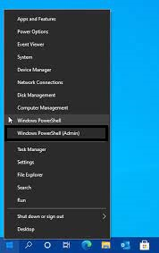

2. click yes

3. use following command: Enable-WindowsOptionalFeature -Online -FeatureName Microsoft-Windows-Subsystem-Linux

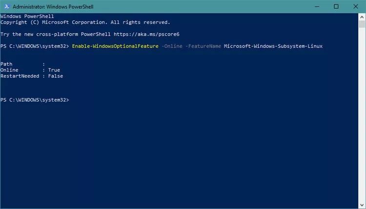

4. type enter

On Ubuntu:
1. Open the terminal.
2. Navigate to the directory containing your Bash script using the cd command.

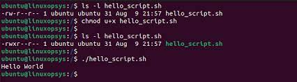

3. Run the script using the following command: ./your_script.sh

Make sure to replace your_script.sh with the actual name of your script. If the script is not executable, you might need to provide execute permissions using chmod +x your_script.sh on Ubuntu.

# how to run a batch file
1. click right on the script or boundle click on a file
2. click open 

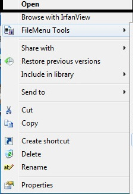

# how to install virtual box

  on linux
  
  method 1:
  1. go to http://virtualbox.org

  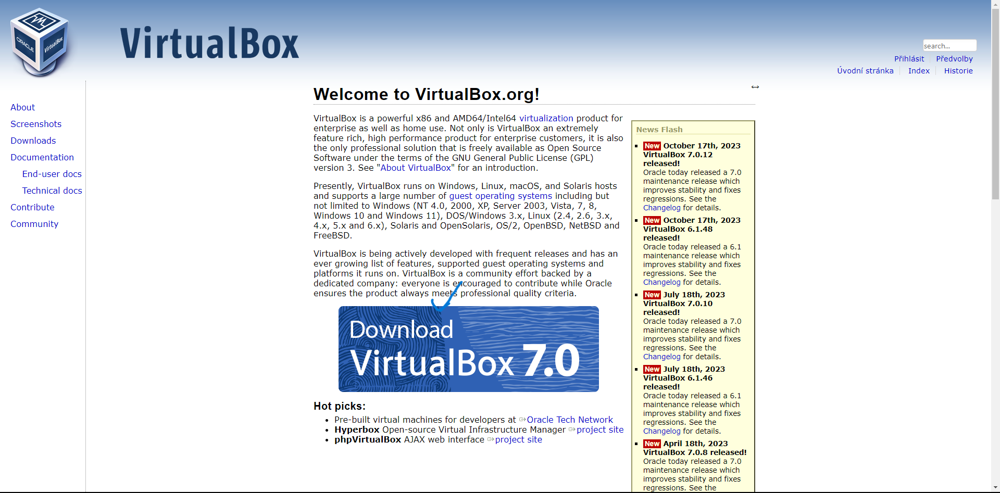
  
  2. click on download
  3. select a system

  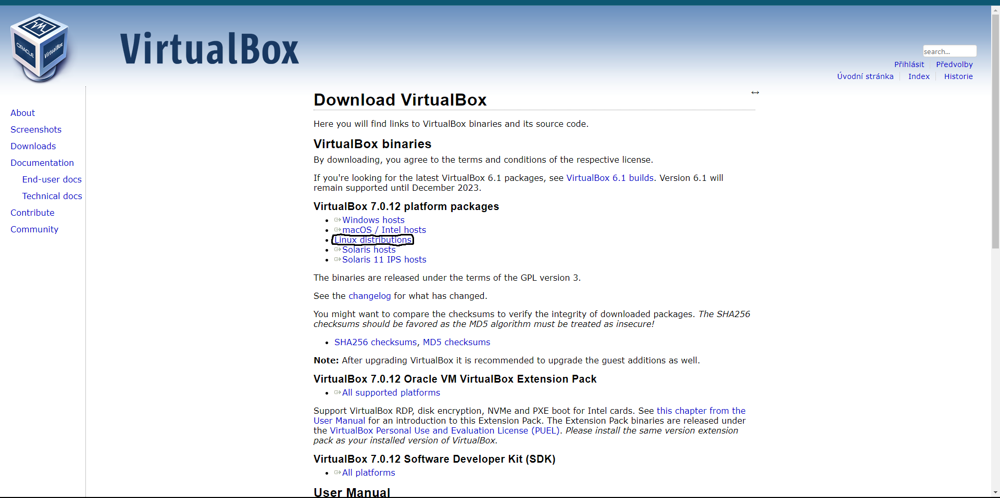

  4. download virtual box
  
   method: 2

   1. open your r´terninal
   2. type "sudo apt install virtualbox"

   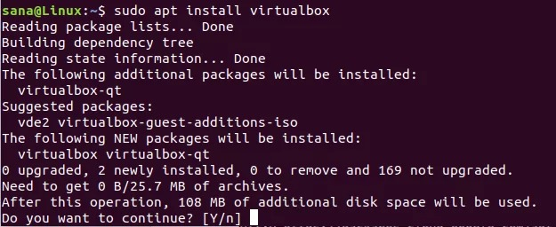

   3. type enter
   4. enter your password
   5. type enter
   6. please wait
   7. type y and enter
   8. wait to install is completed
   9. type virtualbox
   10. create your vm
   11. select a name and operating system
   
   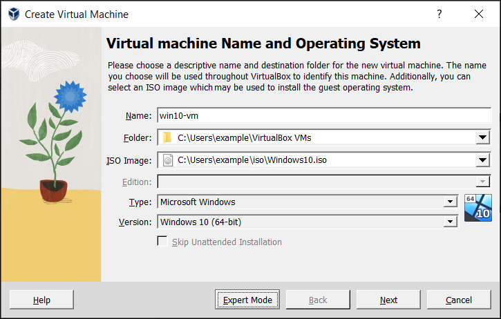

   12. type password product key

   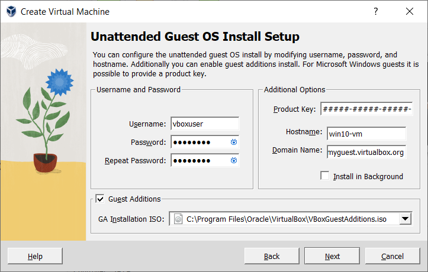

   13. set up ram and cpu (recomended 4GB RAM 2 CORES)
  
   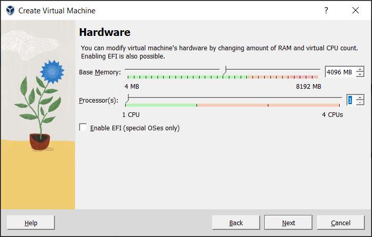

   14.  set up virtual hard drive reccomended 64GB space

   

   # how to install python
   on windows

   Install Python (if not already installed):
   1. If you don't have Python installed on your Windows machine, download the latest version of Python from the official Python website (https://www.python.org/downloads/windows/).
   
   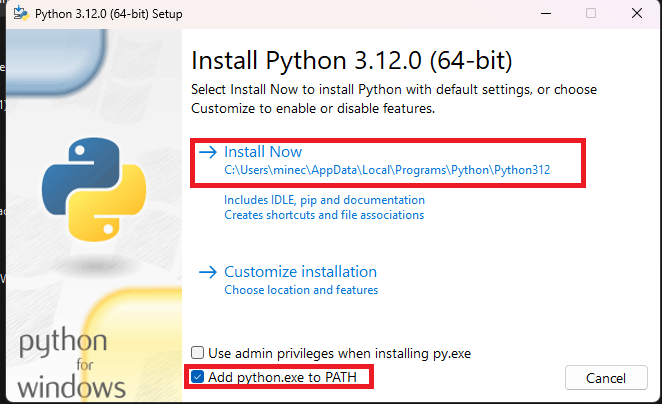

   2. Run the installer and make sure to check the option to add Python to your system's PATH during installation.

   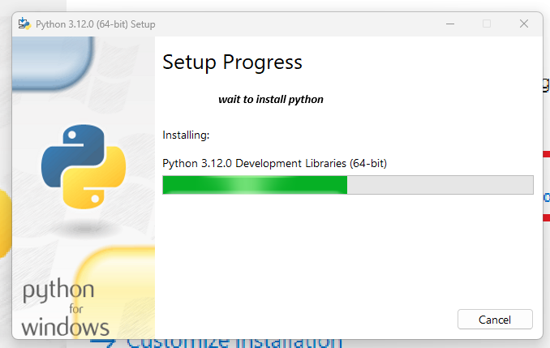

   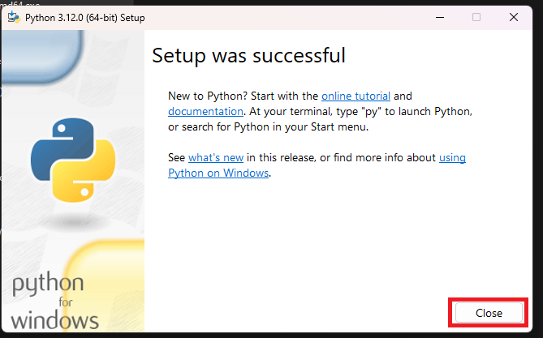

   2. Open Command Prompt:
      Press Win + R, type "cmd," and press Enter to open the Command Prompt.

   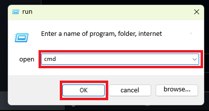

   3. Navigate to the Script Directory:
      Use the cd command to navigate to the directory where your Python script is located. For example, if your script is in the "Scripts" folder on your desktop, you can use the following command to navigate there: (cd C:\Users\YourUsername\Desktop\Scripts)

   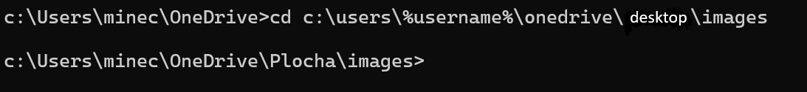

   4. Run the Python Script:
      To execute your Python script, use the following command: python script_name.py
      Replace script_name.py with the actual name of your Python script.

   

   on linux:

Install Python (if not already installed):
Most Linux distributions come with Python pre-installed. To check if Python is installed, open a terminal and run the command:
python --version
If Python is not installed, you can install it using your distribution's package manager. For example, on Ubuntu, you can run:
sudo apt-get update
sudo apt-get install python3

Open Terminal:
Open a terminal window. You can usually find the terminal in your applications menu.

Navigate to the Script Directory:
Use the cd command to navigate to the directory where your Python script is located. For example, if your script is in the "Scripts" folder in your home directory, you can use the following command:
cd ~/Scripts

Run the Python Script:
To execute your Python script, use the following command:
python3 script_name.py
Replace script_name.py with the actual name of your Python script.