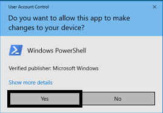
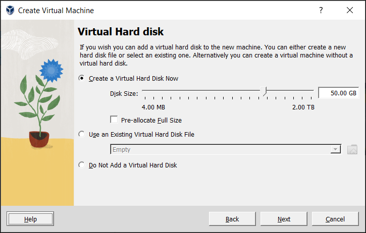

 TIP: searching the needed help press ctrl + F

# how to run a bash script
On Windows:
1. open pawer-shell as administrítor

2. click yes

3. use following command: Enable-WindowsOptionalFeature -Online -FeatureName Microsoft-Windows-Subsystem-Linux

4. type enter

On Ubuntu:
1. Open the terminal.
2. Navigate to the directory containing your Bash script using the cd command.

3. Run the script using the following command: ./your_script.sh

Make sure to replace your_script.sh with the actual name of your script. If the script is not executable, you might need to provide execute permissions using chmod +x your_script.sh on Ubuntu.

# how to run a batch file
1. click right on the script or boundle click on a file
2. click open 

# how to install virtual box

  on linux
  
  method 1:
  1. go to http://virtualbox.org

  
  
  2. click on download
  3. select a system

  

  4. download virtual box
  
   method: 2

   1. open your r´terninal
   2. type "sudo apt install virtualbox"

   

   3. type enter
   4. enter your password
   5. type enter
   6. please wait
   7. type y and enter
   8. wait to install is completed
   9. type virtualbox
   10. create your vm
   11. select a name and operating system
   
   

   12. type password product key

   

   13. set up ram and cpu (recomended 4GB RAM 2 CORES)
  
   

   14.  set up virtual hard drive reccomended 64GB space

   